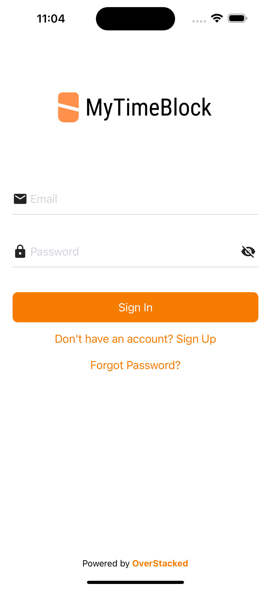
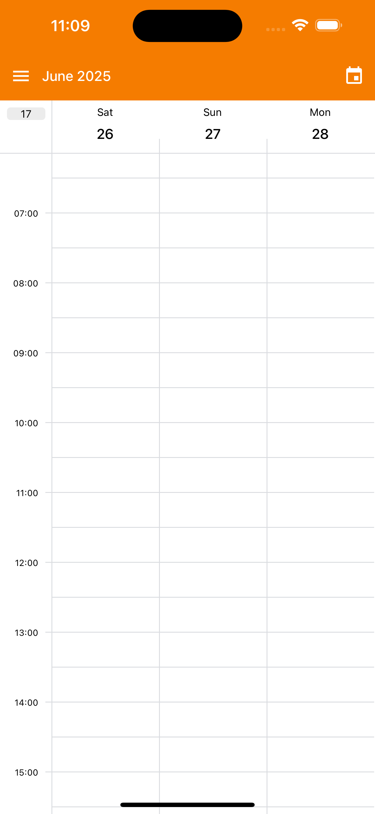
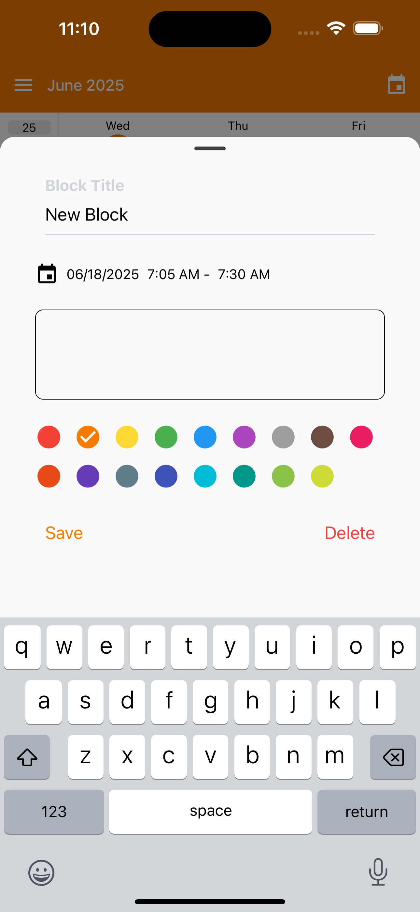

# TimeBlock 📅⏰

A modern and intuitive time-blocking calendar application built with React Native and Expo. 
TimeBlock helps you organize your schedule by creating visual time blocks for your events and tasks, 
making time management more effective and visual.

|  |  |  |
|------------------------|------------------------|------------------------|
| Login             | Creds             | Caption 3              | 


## ✨ Features

### 📱 **Cross-Platform Support**
- iOS, Android, and Web compatibility
- Native performance with React Native
- Responsive design for various screen sizes

### 🔐 **Authentication System**
- Email/password authentication via Firebase
- User account management
- Password recovery functionality
- Secure session management with Redux Persist

### 📅 **Calendar Management**
- Dynamic calendar views (single, double, or triple column layouts)
- Interactive time-blocking interface
- Event creation, editing, and deletion
- Calendar permissions integration
- Real-time event synchronization

### 🎨 **Modern UI/UX**
- Material Design components with React Native Paper
- Themed interface with dark/light mode support
- Bottom sheet modals for event details
- Smooth animations with Reanimated
- Custom drawer navigation

### 🛡️ **Reliability & Performance**
- Firebase Crashlytics integration
- Redux state management
- Optimized rendering with FlashList
- Gesture handling for better UX

## 🛠️ Tech Stack

### **Frontend**
- **React Native** 0.76.6 - Cross-platform mobile development
- **Expo** ~52.0.33 - Development platform and build tools
- **TypeScript** - Type safety and better development experience
- **Expo Router** - File-based navigation system

### **State Management**
- **Redux Toolkit** - Predictable state container
- **React Redux** - React bindings for Redux
- **Redux Persist** - State persistence

### **UI Libraries**
- **React Native Paper** - Material Design components
- **React Native Elements** - Additional UI components
- **@howljs/calendar-kit** - Advanced calendar components
- **@gorhom/bottom-sheet** - Native bottom sheet modals

### **Backend & Services**
- **Firebase Authentication** - User authentication
- **Firebase Crashlytics** - Crash reporting and analytics
- **AsyncStorage** - Local data persistence

### **Development Tools**
- **Jest** - Testing framework
- **ESLint** - Code linting
- **Prettier** - Code formatting
- **React Hook Form** - Form management

## 🚀 Getting Started

### Prerequisites
- Node.js (v18 or later)
- npm or yarn
- Expo CLI
- iOS Simulator (for iOS development)
- Android Studio & Android Emulator (for Android development)

### Installation

1. **Clone the repository**
   ```bash
   git clone https://github.com/your-username/TimeBlock.git
   cd TimeBlock
   ```

2. **Install dependencies**
   ```bash
   npm install
   # or
   yarn install
   ```

3. **Set up Firebase**
   - Create a Firebase project at [Firebase Console](https://console.firebase.google.com/)
   - Enable Authentication and Crashlytics
   - Download `google-services.json` (Android) and `GoogleService-Info.plist` (iOS)
   - Place them in the project root directory

4. **Start the development server**
   ```bash
   npx expo start
   ```

### Running on Different Platforms

```bash
# Run on iOS Simulator
npx expo run:ios

# Run on Android Emulator  
npx expo run:android

# Run on Web
npx expo start --web
```

## 📱 Platform-Specific Setup

### iOS Setup
- Requires Xcode for iOS development
- CocoaPods dependencies are automatically managed
- Uses static frameworks for better compatibility

### Android Setup
- Requires Android Studio
- Minimum SDK version: 21
- Target SDK version: 34
- Calendar permissions are automatically requested

## 🏗️ Project Structure

```
TimeBlock/
├── app/                    # App screens and navigation
│   ├── (auth)/            # Authentication screens
│   │   ├── sign-in.tsx
│   │   ├── sign-up.tsx
│   │   └── forgot-password.tsx
│   └── (drawer)/          # Main app screens
├── components/            # Reusable UI components
│   ├── Calendar.tsx       # Main calendar component
│   ├── EventBottomSheet.tsx
│   ├── ColorPicker.tsx
│   └── icons/             # Custom icon components
├── store/                 # Redux store configuration
│   ├── index.ts           # Store setup
│   └── slices/            # Redux slices
│       ├── authSlice.ts   # Authentication state
│       └── calendarSlice.ts # Calendar state
├── hooks/                 # Custom React hooks
├── constants/             # App constants and colors
├── types/                 # TypeScript type definitions
└── assets/                # Images, fonts, and static assets
```

## 🔧 Available Scripts

```bash
# Start development server
npm start

# Run linting
npm run lint

# Fix linting issues
npm run lint:fix

# Format code
npm run format

# Run tests
npm test

# Reset project (removes example code)
npm run reset-project
```

## 🧪 Testing

The project uses Jest for testing with Expo's testing configuration:

```bash
npm test
```

## 📦 Building for Production

### Using EAS Build (Recommended)
```bash
# Install EAS CLI
npm install -g @expo/eas-cli

# Build for iOS
eas build --platform ios

# Build for Android
eas build --platform android
```

### Local Builds
```bash
# Build locally for iOS
npx expo run:ios --configuration Release

# Build locally for Android
npx expo run:android --variant release
```

## 🤝 Contributing

1. Fork the repository
2. Create your feature branch (`git checkout -b feature/amazing-feature`)
3. Commit your changes (`git commit -m 'Add some amazing feature'`)
4. Push to the branch (`git push origin feature/amazing-feature`)
5. Open a Pull Request

## 📄 License

This project is licensed under the MIT License - see the [LICENSE](LICENSE) file for details.

## 🆘 Support

If you encounter any issues or have questions:

1. Check the [Issues](https://github.com/your-username/TimeBlock/issues) page
2. Create a new issue with a detailed description
3. For urgent matters, contact [admin@mytimeblock.com]

## 🙏 Acknowledgments

- [Expo Team](https://expo.dev) for the amazing development platform
- [React Native Community](https://reactnative.dev) for the robust framework
- [Firebase](https://firebase.google.com) for backend services
- All the open-source contributors who made this project possible

---

Built with ❤️ using React Native and Expo
